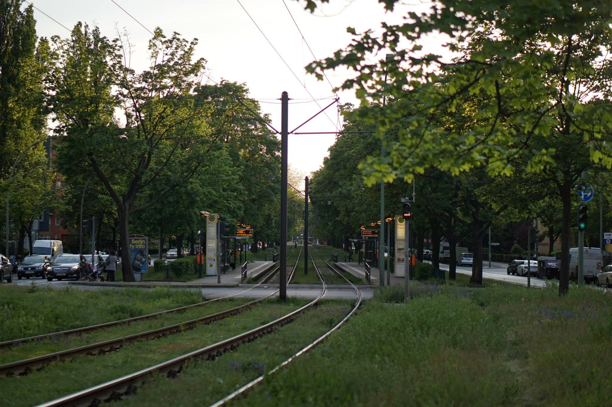
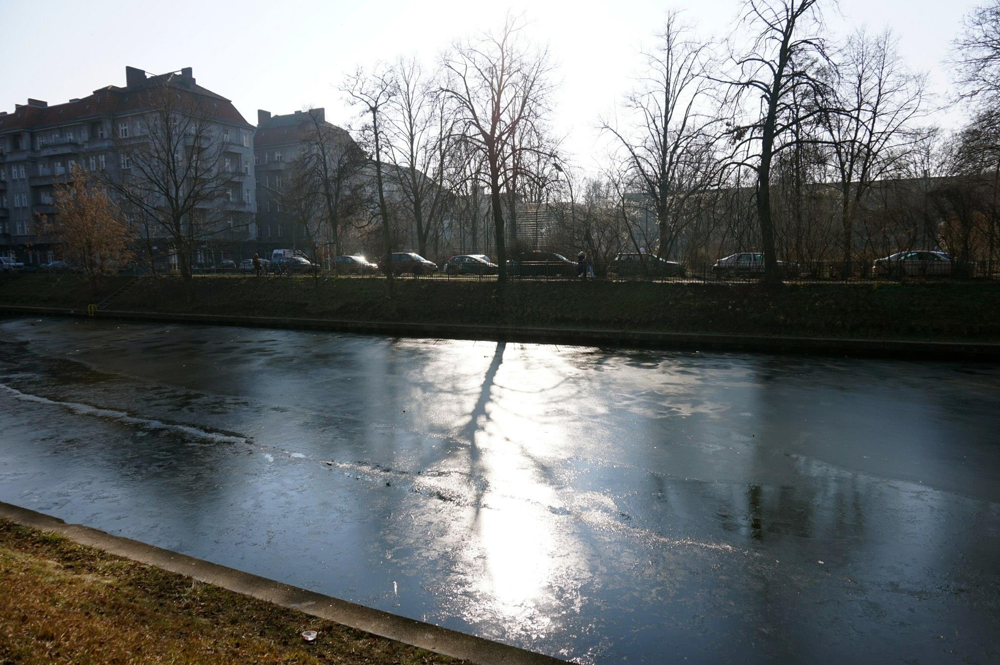
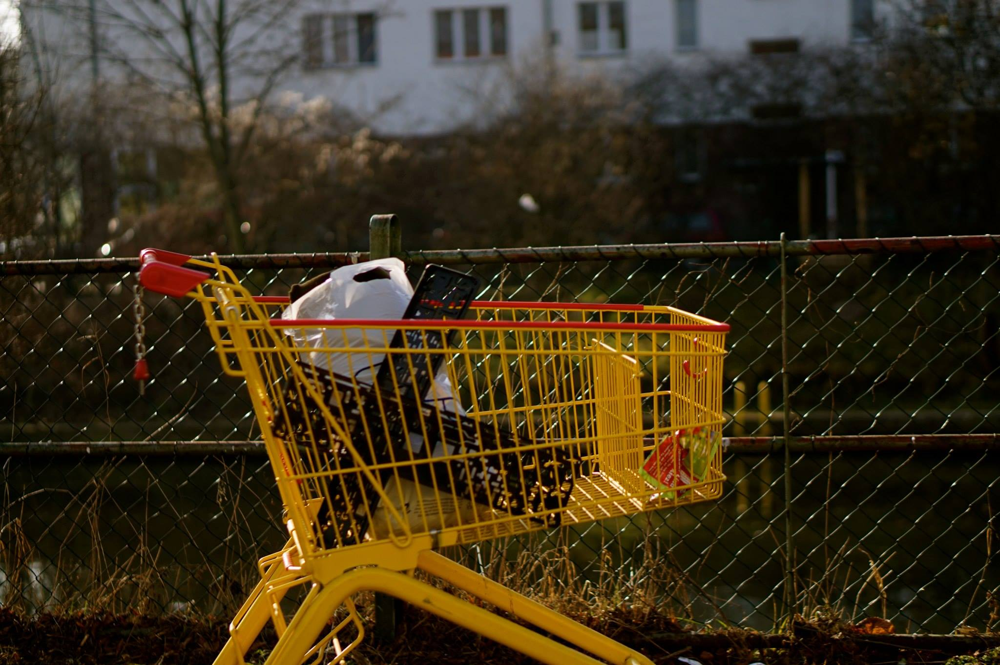

<section class="slider loading">
  

    <ul class="slides">
      <li data-thumb="img1.jpg">
        
      </li>
      <li data-thumb="img2.jpg">
        
      </li>
      <li data-thumb="img3.jpg">
        
      </li>
      <li data-thumb="img4.jpg">
        
      </li>
      <li data-thumb="img5.jpg">
        
      </li>
      <li data-thumb="img6.jpg">
        
      </li>
      <li data-thumb="img7.jpg">
        
      </li>
      <li data-thumb="img8.jpg">
        
      </li>
      <li data-thumb="img9.jpg">
        
      </li>
      <li data-thumb="img10.jpg">
        
      </li>
      <li data-thumb="img11.jpg">
        
      </li>
    </ul>
  

</section>
